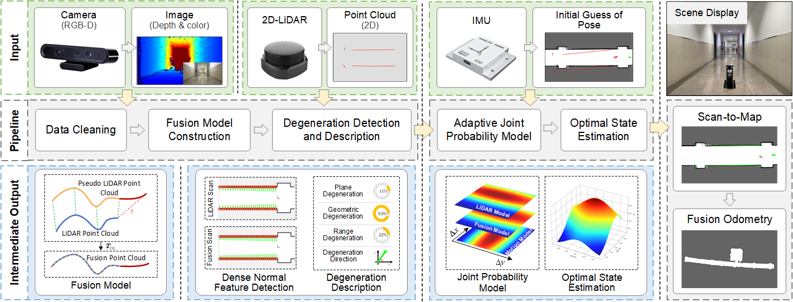

# DGMapping: Degeneration-Guided Adaptive Multi-Sensor Fusion

[](https://rainyrobo.github.io/DGMapping/)
[](https://huggingface.co/datasets/RainyBot/DGMapping)
[](LICENSE)
[](https://huggingface.co/datasets/RainyBot/DGMapping)
[](#3-build--demos)
[](include/dgmapping/)

Reference implementation of the DGMapping paper's algorithmic core:
Sampling-Optimized ICP for RGB-D pseudo-LiDAR / 2D LiDAR fusion, an
online degeneracy detector, and a degeneration-guided patch for
Cartographer's 2D correlative scan matcher.

This release focuses on the reusable core modules and lightweight demos.
Full system integration code is intentionally kept outside this repository
for now.



## 1. Directory Structure

The repository is organised for modular use and straightforward
integration with existing SLAM frameworks, especially Google
Cartographer.

```
DGMapping/
├── cartographer/                                  # Placeholder for the upstream framework
├── include/dgmapping/                             # [Core] degeneracy-aware fusion modules
│   ├── so_icp.h                                   # Sampling-Optimized ICP (header-only)
│   ├── degeneracy_detector.h                      # Degeneracy detection (header-only)
│   └── real_time_correlative_scan_matcher_2d.h    # Adaptive fusion interface for degeneracy handling
├── src/
│   ├── so_icp_demo.cc                             # Standalone demo for SO-ICP
│   ├── degeneracy_detector_demo.cc                # Standalone demo for the degeneracy detector
│   └── real_time_correlative_scan_matcher_2d.cc   # Implementation of degeneration-aware CSM
├── CMakeLists.txt
└── LICENSE
```

`so_icp.h` and `degeneracy_detector.h`, together with the two demos,
depend only on **Eigen 3** and a **C++17** compiler. The patched
`real_time_correlative_scan_matcher_2d.cc` is a drop-in replacement for
the file of the same name in
[Google Cartographer](https://github.com/cartographer-project/cartographer)
and therefore requires the rest of Cartographer to compile; it is
**not** built by default.

## 2. Core API & Mathematical Formulation

The two header-only modules, `SoIcp` and `DegeneracyDetector`, implement
the main algorithms described in the paper, while
`RealTimeCorrelativeScanMatcher2D` exposes the degeneration-aware scan
matching interface used for integration into Cartographer.

### 2.1 Degeneracy descriptors

`DegeneracyDetector::DetectDegeneracy` returns a `DegeneracyResult`
containing five descriptors corresponding to the paper's equations:

| Code accessor      | Symbol  | Equation | Physical interpretation |
|:-------------------|:-------:|:--------:|:------------------------|
| `result.R_deg()`   | $R_{deg}$ | Eq. (7)  | Range degeneration       |
| `result.G_deg`     | $G_{deg}$ | Eq. (12) | Geometric degeneration   |
| `result.L_deg()`   | $L_{deg}$ | Eq. (8)  | LiDAR degeneration       |
| `result.F_deg()`   | $F_{deg}$ | Eq. (9)  | Fusion degeneration      |
| `result.phi()`     | $\varphi$ | Eq. (11) | Principal direction      |

`R_deg()`, `L_deg()`, `F_deg()`, and `phi()` are convenience accessors
that mirror the arguments expected by the patched scan matcher.

### 2.2 Integration workflow

The snippet below illustrates a typical Scan-to-Map integration pattern
using DGMapping. It is intended as an API-level example showing how the
three components connect inside a larger SLAM pipeline.

```cpp
#include "dgmapping/so_icp.h"
#include "dgmapping/degeneracy_detector.h"
#include "cartographer/mapping/internal/2d/scan_matching/real_time_correlative_scan_matcher_2d.h"

using namespace cartographer::mapping::scan_matching;

void RunDegeneracyGuidedMatching() {
  // I. Data acquisition
  std::vector<RangefinderPoint> raw_scan    = GetLidarScan();         // P^L
  std::vector<RangefinderPoint> depth_cloud = GetCameraPseudoLidar(); // P^D

  // II. Sampling-Optimized ICP fusion (Sec. III-B, Algorithm 1)
  SoIcp so_icp(SoIcpOptions{});
  SoIcpResult align = so_icp.Align(depth_cloud, raw_scan);
  auto fused_cloud =
      BuildFusedObservation(raw_scan, depth_cloud, align);  // z^F_t

  // III. Degeneracy analysis (Sec. III-C, Eqs. 5-12)
  DegeneracyDetector detector(DegeneracyDetectorOptions{});
  auto deg = detector.DetectDegeneracy(raw_scan, fused_cloud);

  // IV. State estimation (degeneration-guided CSM, Sec. III-D, Eqs. 13-17)
  cartographer::transform::Rigid2d pose_estimate;
  cartographer::transform::Rigid2d initial_pose =
      cartographer::transform::Rigid2d::Translation({2.5, 2.5});

  double score = real_time_correlative_scan_matcher_->Match(
      initial_pose,
      raw_scan,
      *probability_grid,
      &pose_estimate,
      fused_cloud,           // visual constraints  z^F_t
      deg.R_deg(),           // range degeneration weight
      deg.G_deg,             // geometric degeneration weight
      deg.L_deg(),           // LiDAR model penalty
      deg.F_deg(),           // fusion model penalty
      deg.phi());            // principal direction
}
```

## 3. Build & Demos

Two standalone demos are provided for quick algorithm-level validation.

> **Note**
> This release contains the core algorithmic modules and their standalone
> demos. A full engineering deployment, including ROS integration,
> Docker support, and launch files, will be released after the paper's
> formal acceptance.

### Prerequisites

- CMake ≥ 3.13
- C++17-compatible compiler (GCC >= 9 / Clang >= 10 / MSVC 2019+)
- Eigen 3
- Cartographer (optional, only needed for the patched scan matcher)

On Debian / Ubuntu:

```bash
sudo apt-get install -y build-essential cmake libeigen3-dev
```

### Build

```bash
cmake -S . -B build -DCMAKE_BUILD_TYPE=Release
cmake --build build -j
```

### Run

```bash
./build/so_icp_demo
./build/degeneracy_detector_demo
```

This generates two executables under `build/`:

- `build/so_icp_demo` runs SO-ICP on a synthetic 2D scene with simulated
  noise and outliers, then prints the recovered transform.
- `build/degeneracy_detector_demo` runs the detector on three synthetic
  scenes (L-shaped room, long corridor, and sparse arc) and prints the
  resulting descriptors for side-by-side inspection.

Both demos are deterministic (seeded RNG) and require no external data.

To additionally build the patched scan matcher, Cartographer must be
discoverable via `find_package(cartographer)`:

```bash
cmake -S . -B build -DDGMAPPING_BUILD_SCAN_MATCHER=ON
```

To integrate DGMapping's patched matcher into your own Cartographer tree,
see
[`cartographer/README.md`](cartographer/README.md).

## 4. Roadmap

This repository will continue to be maintained. The current release
covers the core algorithmic modules and the minimal demo programs needed
to verify them.

- [x] Initial release: `SoIcp`, `DegeneracyDetector`, the patched scan
  matcher source, and two standalone demos
- [ ] Full engineering deployment: Cartographer / ROS integration,
  Docker image, dataset utilities, and a reproducibility kit

## Acknowledgments

We gratefully acknowledge the open-source contribution of Google
Cartographer, which provides the foundation for this implementation.
DGMapping is built upon the
[cartographer](https://github.com/cartographer-project/cartographer)
repository.

We strictly follow the **Apache 2.0 License** of the original project
(see [`LICENSE`](LICENSE)). If you use this code, please also credit the
original Cartographer authors:

> W. Hess, D. Kohler, H. Rapp, and D. Andor, "Real-time loop closure in
> 2D LIDAR SLAM," in *IEEE International Conference on Robotics and
> Automation (ICRA)*, 2016.
